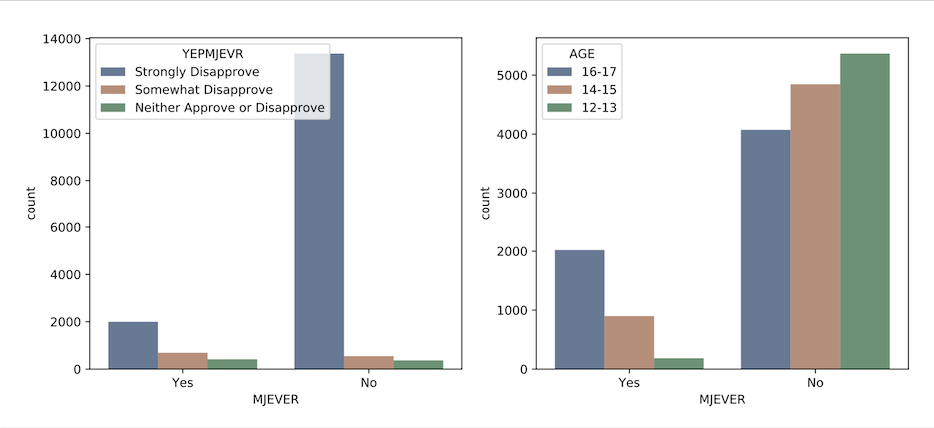
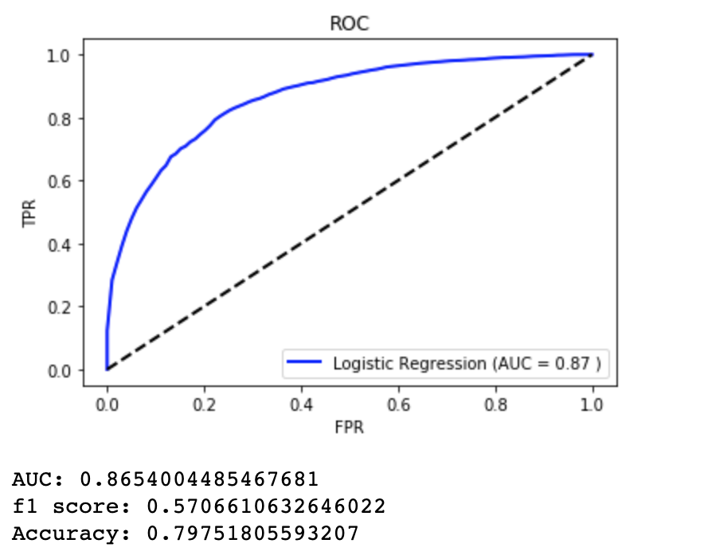
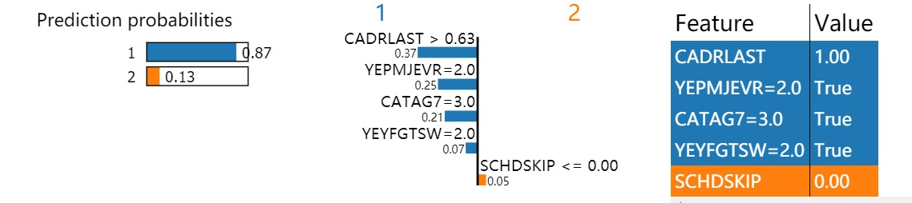
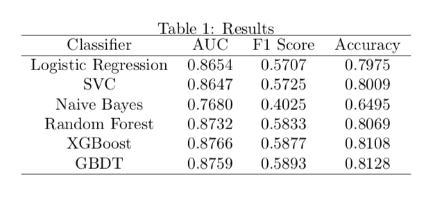
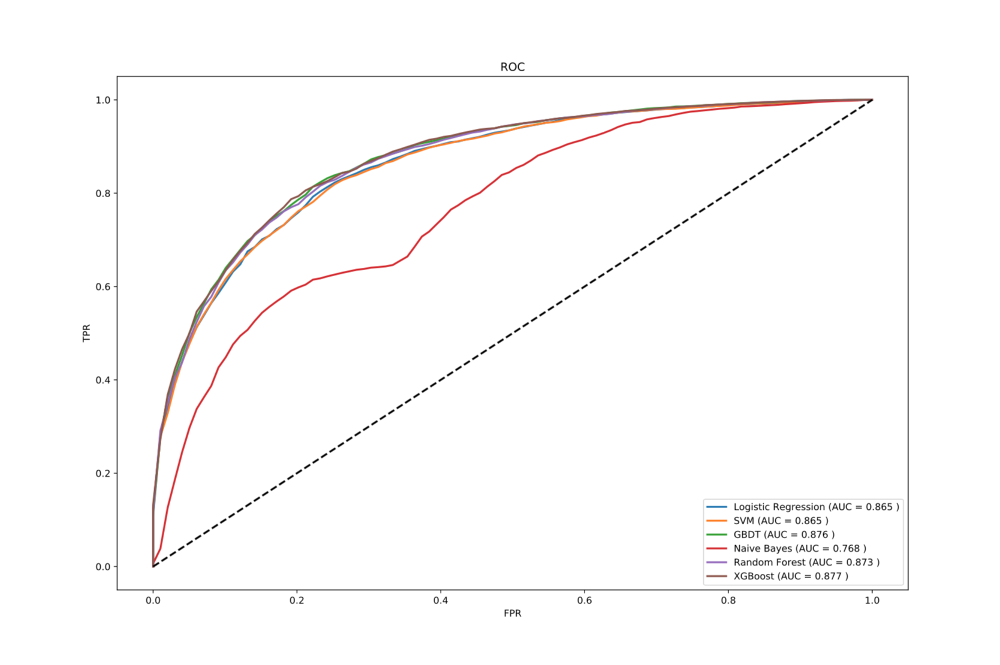
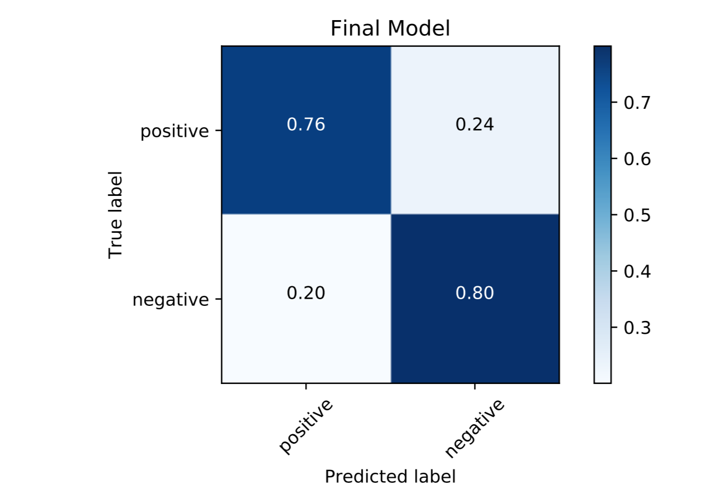
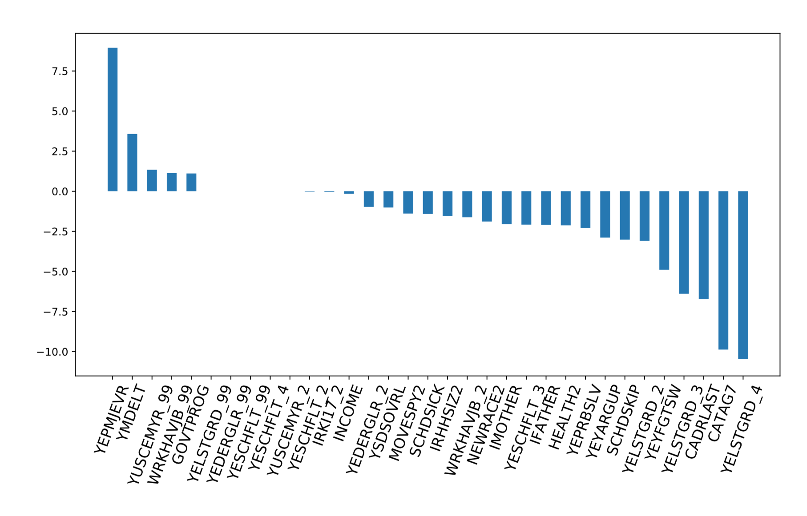
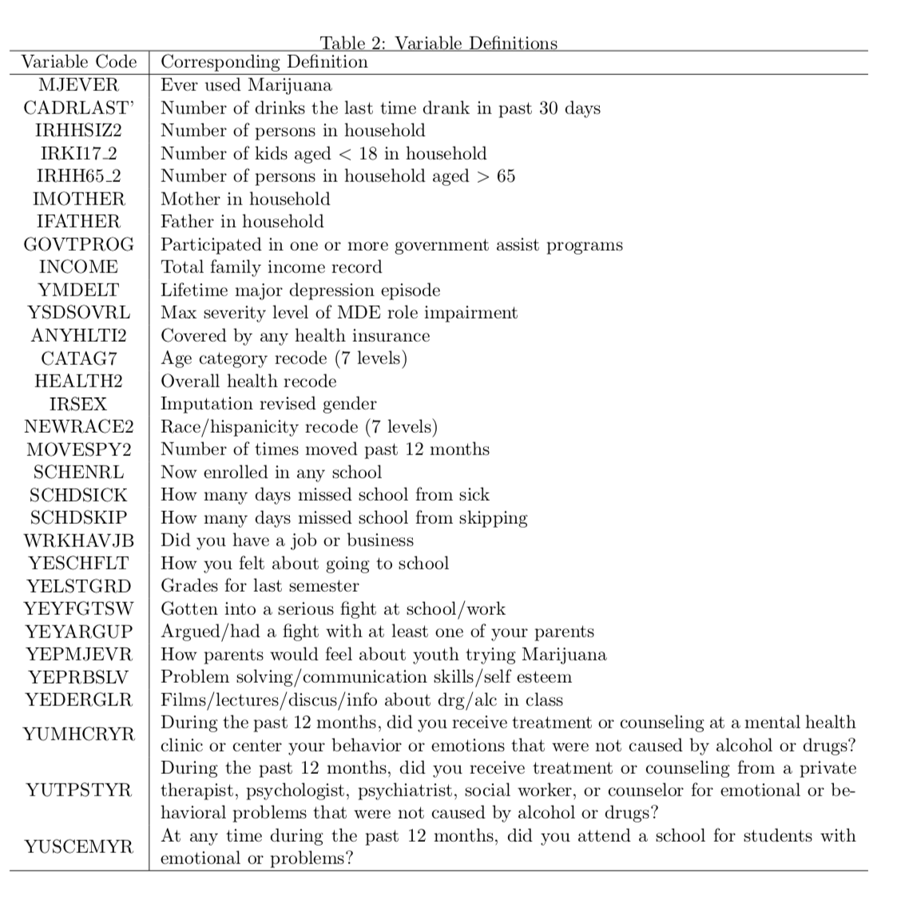

# Drug Killer: Detecting Youth Cannabis Usage

Capstone Project for New York University's Center for Data Science: Introduction to Data Science

## Directory Structure
`Code` contains code used in this project

`Data` contains data used in this project

`Paper` contains the final write up with methods and results used for this project

`Images` contains images and statistical graphs produced

# Introduction

## Objective
The problem proposed is to detect marijuana usage for youth, specifically the people aged 18 and under to utilize these findings for preventative purposes

## Why? 
A number of U.S. states have already legalized or are in the process of legalizing cannabis. The increasing prevalence leads to an increase in the percentage of tetrahydrocannabinol (THC), the most active ingredient in cannabis, making the drug more potent. Over the last two decades, there are significant studies which establishes links between cannabis use and psychotic outcomes.

## Overview
We focus on youth to gear our study on the reasons people start using the drug at a young age. Teenagers may tend to use cannabis in undisclosed circumstances, making it hard to detect the likelihood of cannabis use by a specific individual directly at some point in the future. We plan on using features such as cannabis lifetime, annual, and past-month usage, substance abuse treatment history, perceived need for treatment, mental health history and perception of the drug in general. Other features include health care access and coverage, illegal activities and arrest record. Our data is pulled from the [National Survey on Drug Use and Health, 2012](https://www.icpsr.umich.edu/icpsrweb/ICPSR/studies/34933?q=&paging.rows=25&sortBy=10#). The survey measures prevalence and correlates of drug use in each of the 50 U.S. states. There is 3120 variables in the original data source and we are aiming to narrow the variables down to about 30. The data instance is the 17,399 respondents in the study under 18 years old.

By constructing such a model with cannabis usage of people under the age of 18 as the target variable and these individual chosen attributes as predictors, we define the supervised data mining problem as a classification problem. Marijuana usage is to be defined as a binary variable (Marijuana [Yes/No]). We will be analyzing the data to find correlations between the predictor variables and the target variables in the training data. We run our model on our training data(NSDUH).

## Goal
To summarize, the goals of this project is to: 

1. Aim to propose a machine learning and statistical approach to pattern detection and to developing predictive models for cannabis usage which leads to first-episode psychosis and other related mental and physical deterioration.

2. Develop a model can be used by government institutions, schools, children’s hospitals, and medical research facilities.

## Part 1: Data Understanding: Data Collection and Extracted Features 

We downloaded the datasets from University of Michigans ICPSR data repository. Our data is pulled from the National Survey on Drug Use and Health, 2012. The survey measures prevalence and correlations of drug use in each of the 50 U.S. states. There is 3120 variables in the original data source, but we have chosen to focus on 31 variables. We chose the 31 variables from each sub-category: mental health, personality, depression, academic and home environments in order to provide a representative features from each subgroup in the original dataset. The original data source also included variables for adults so we left them out to focus on youth-relevant variables such as schooling. We chose variables that were easily attainable with high response rate and non-personal. Since this is survey based data, it is highly likely that participants can game the questions or be subject to voluntary response bias. We did not include variables like times moved in the past 5 years or importance of friends sharing the same religious beliefs, because it does not share relevance in the prediction of marijuana usage. 

We focus on the age group 12-17 year olds to utilize these findings for preventative purposes amongst adolescence. We focus on youth to gear our study on the reasons people start using the drug at a young age in order to predict implications for the future. 

### Feature Engineering
The target variable is the binary variable - marijuana usage. The base rate (from the target variable) of respondents that have used marijuana versus those who haven’t is in the ratio: 3102:14283. We read in the subsetted data by including respondents aged between the ages of twelve to seventeen. 

Here are the initial transformations we performed: 
```
data = pd.read_csv("34933-0001-Data.tsv", sep = ‘\t')
var = ['MJEVER','CADRLAST', 'IRHHSIZ2', 'IRKI17_2', 'IRHH65_2', 'IMOTHER', 'IFATHER', 
       'GOVTPROG', 'INCOME', 'YMDELT', 'YSDSOVRL', 'ANYHLTI2', 'CATAG7', 'HEALTH2', 
       'IRSEX', 'NEWRACE2', 'MOVESPY2', 'SCHENRL', 'SCHDSICK', 'SCHDSKIP'
       ,'WRKHAVJB','YESCHFLT','YELSTGRD', 'YEYFGTSW', 'YEYARGUP', 'YEPMJEVR', 'YEPRBSLV','YEDERGLR', 'YUMHCRYR', 'YUTPSTYR', ‘YUSCEMYR'] ##31 Variables
```

### Error Handling
```
#drink time in past 30 days 0-30
data.loc[data['CADRLAST']==991, 'CADRLAST'] = 0 #never used alcohol
data.loc[data['CADRLAST']==993, 'CADRLAST'] = 0 #did not use alcohol in past 30
data.loc[data['CADRLAST']==985, 'CADRLAST'] = np.nan # bad data
data.loc[data['CADRLAST']==994, 'CADRLAST'] = np.nan #dont know 
data.loc[data['CADRLAST']==997, 'CADRLAST'] = np.nan #refused
data.loc[data['CADRLAST']==998, 'CADRLAST'] = np.nan #blank
data['CADRLAST'] = data['CADRLAST'].fillna(data['CADRLAST'].mean()) #all filled with mean
```
#### Missing Values
1. Legitimate Skips: This happens because people may answer differently to other ques- tions, thus certain questions dont apply to certain groups of people. These groups of people may share some hidden common characteristics which may affect the target variable. Therefore, for questions that are answered with legitimate skips, we conducted chi-square tests to decide whether the skipped answers should be filled with mean/mode values or should be treated as another feature. If the test result indicates that there is significant distributional difference of the target variable between the skip- ping group and the common group, we use a dummy variable to denote whether this value is missing or not. We can replace legitimate skip with the mode or mean of the respective variable only in the case when there are no significant results.

2. Random Missing Responses: There are cases where people leave the question blank or choose I dont know. We regard these kind of missing values as random missing. To account for random missing values, we replaced them with mean values for all continuous variables and mode values for all discrete variables.

#### Train-Test Split

```
X = data.iloc[:,1:].values
y = data.iloc[:,0].values
X_t, X_test, y_train, y_test = train_test_split(X, y, test_size=0.3, random_state=42)
```
We used the train test split function from sklearn to split our dataset randomly into training and testing data sets, without overlap. This is used for training the model, doing cross-validation, and testing the dataset used for final performance. We used 30 percent of our data set as the test data while the rest was used for training.

## Part 2: Descriptive Statistics
Two of the interesting descriptive statistics are shown here. The distributions of features are compared between respondents who have used Marijuana and those who have never used it. Figure 1(Left) shows the distribution of the variable YEPMJEVR (how parents would feel you trying Marijuana) amongst 12-17 year olds compared against the MJEVER (Marijuana use) target variable. We can see that despite whether you are using marijuana or not, parents would tend to disapprove of the drug. However, although the group size of Marijuana users is much smaller, the number of those with somewhat disapproval or neutral attitudes from parents are higher than that for samples that have never used Marijuana.

Figure 1(Right) shows the distribution of ages in the sample between those who use marijuana and those who dont. Out of the people that use marijuana, the older you get, the more likely you will start using. This fact indicates that youth are allured to Marijuana use continously as they grow up. These differences of distributions make our prediction possible and also help to explain the model later.




Figure 1: Histogram of MJEVER (Target Variable/Marijuana usage) plotted against YEPMJEVR(how parents would feel you trying Marijuana) (Left) & Histogram of MJEVER (Target Variable/Marijuana usage) plotted against distribution of Age (Right)

## Part 3: Cross Validation
```
from sklearn.feature_selection import chi2
p_val = chi2(X_t, y_t)[1]
var_select = np.array(var[1:])[p_val<0.05]
data_select = data.loc[:, var_select]
```

```
var_dum = ['WRKHAVJB','YESCHFLT','YELSTGRD','YEDERGLR','YUSCEMYR']
for i in var_dum:
    data_select = pd.merge(data_select, pd.get_dummies(data_select[i], prefix=i, drop_first=True), left_index = True, right_index =True) 
    data_select.drop(i, axis=1, inplace=True)
```

```
X = data_select.iloc[:,:].values
y = data.iloc[:,0].values
X_t, X_test, y_t, y_test = train_test_split(X, y, test_size=0.3, random_state=42)
```

## Part 4: Modeling

### Logistic Regression

Logistic regression is an algorithm suitable for a small dataset and is able to output a probabilistic interpretation. Moreover, after normalizing all the attributes, the scale of the weight can directly reflect the importance of each feature. To avoid overfitting, we tuned the hyperparameters related to the penalty terms. We used l1 and l2 penalty with varying regularization strength. For regularization strength, we initially searched through a wide rough range and gradually narrowed our search space, until we found the optimal value.

The link to the python code can be found [here](Code/project_1.1.ipynb).



### Deployment: LIME package


We can use the LIME (Locally Interpretable Model-Agnostic Explanations) package to provide local model interpretability (Brown, 2018). In the figure below we are explaining individual predictions for the logistic regression classifier using the LIME package.

The figure above tells us that the test sets ith prediction is 0.87. SCHDSKIP (How many days missed school from skipping) provides us with the most negative valuation and the other features provide a positive valuation in the prediction.

By providing local model interpretability, we can enable schools and policy makers to learn about the factors that encourage certain individuals to engage in marijuana usage and make decisions. For instance, a school could look at all individuals with prediction probabilities greater than 0.75. By looking at these individuals and the features that provided positive valuation to marijuana usage, they could make suitable decisions about mental health programs, counseling, etc.

We can also give students an annual survey with the same questions and conduct this on the national level. We may find that certain school or geographic communities have higher rate of potential marijuana usage in youth. Thus, this helps us target specific groups of people to instigate an intervention. Feedback from schools, communities, mental health groups, associations, and parents on a bi-annually would be useful. Some things to consider before deploying this particular finding for public use is to acknowledge that not all marijuana usage is detrimental. In other words, not all marijuana smoking, vaping or consuming should necessarily be brought to attention. This could lead to overstating the seriousness of the issue. One risk is schools may totally ban marijuana use and consumption which could backfire and encourage students to use the drug more. Since marijuana is the third most prevalent drug in the U.S., the responsibility of adults and learning environments is to communicate the risks and drug perception clearly.

## Part 5: Results


The result of each algorithm is shown in Table 1. If we argue appropriate model, we could conclude that most classifiers perform equally well on our data and XGBoost is the best classifier. However as we see from the table below, XGBoost is only slightly better than the Logistic Regression Model. XGBoost acts like a black box model while logistic regression has an intuitive statistical explanation. Considering interpretability and model complexity being important criteria; we choose logistic regression as our final model. Finally, we retrain our model on the whole training set with the best hyper parameter (l1 penalty, C=1.2), and evaluate our final model on the test set, which give us AUC of 0.8661, f1 score of 0.5897 and accuracy of 0.7931. The confusion matrix of the test set is also shown.





### Survey Reliability

The survey shows a high percentage of response. Even when there is an option to skip certain questions, 99.91 percent respondents have answered either yes or no for the target variable . It should be noted that positive individuals (answered yes) may have lied about their marijuana usage due to social pressure, however, respondents that have responded no to marijuana usage are more likely not to have gamed the survey because there is no incentive or reason for lying. Thus, respondents who have responded yes to marijuana usage in the survey will have higher reliability than those who have responded otherwise because there is no reason for he or she to have lied. Since the dataset is highly imbalanced and negative data is sufficient, the impurity of negative samples is treated as a minor problem.


### Conclusion
One of the advantages of logistic regression is that it can give an explicit expression of the classification model, which is a function of the linear combinations of all the explanatory variables. Since we have normalized all the features, the weight of logistic regression can represent the importance of each feature directly. Though correlation between explanatory variables may have some confusing effects on the weight, we can safely conclude that at least the direction of effects would be the same for the most important features. In Figure 4, we plot the weight of each of the 31 chosen attributes in a bar plot. From the plot we can conclude that YEPMJEVR, YMDELT ,CATAG7 and YELSTGRD-4 are four of the most significant factors that affect marijuana use, which leads to the following findings:

1. The more parents care about their childrens marijuana use, the less likely children will start use marijuana. Schools should communicate with parents if their children show signs of drug use, academic

2. Depression is one of the key reasons for initial marijuana use. Social programs and schools should cater more resources to the mental health of teenagers especially at the adolescence stage. Counseling, mental-health programs, anti-bullying campaigns are examples of effective solutions.

3. Older teenagers are more likely to use marijuana than younger teenagers. As expected, older teenagers learn more about this recreational drug through media and society, which does not do a good job of portraying the danger of the drug, making it more prevalent. As of 2017, it is the third most popular drug in America behind tobacco and alcohol. Again, schools and parents have the responsibility to educate teenagers about the risks of drug abuse in general and the detriment of peer pressure and following media trends.

4. Teenagers ages 12-17 using marijuana are more likely to have a bad academic performance. Though the levels of marijuana intake and reactions can vary from person to person, marijuana is tied to poorer school performance because students are more likely to exhibit reduced neural connectivity in regions responsible for memory, learning and inhibitions. Thus, educating youth about these physical and mental consequences are important.



## Appendix

### Variable Definitions


## Citations
[1] Rennie, Jason D. M., et al. Tackling the Poor Assumptions of Naive Bayes Text Classifiers. peo- ple.csail.mit.edu/jrennie/papers

[2] Brown, Eric. Local Interpretable Model-Agnostic Explanations - LIME in Python. Python Data, 11 June 2018, pythondata.com/local-interpretable-model-agnostic-explanations-lime-python/.

[3] Marijuana Use Tied to Poorer School Performance. ScienceDaily, ScienceDaily, 11 May 2017, (www.sciencedaily.com/releases/2017/05/170511083745.htm).

[4] Hoffman, Jan. Marijuana and Vaping Are More Popular Than Cigarettes Among Teenagers. The New York Times, The New York Times, 14 Dec. 2017, (www.nytimes.com/2017/12/14/health/teen-drug-smoking.html).


=======


